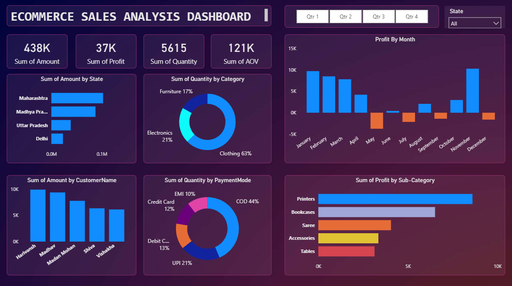

# Revenue & Sales Performance Analysis

## Overview

This project presents a Power BI analysis of e-commerce sales data, focusing on sales, profitability, customer segments, product performance and delivery patterns.

The aim was to transform transactional data into a clear reporting view that can support business performance analysis and decision-making.

## Dashboard

## Key Metrics

* Total Sales: 1.57M
* Total Profit: 175K
* Total Quantity: 22K
* Profit Margin: approximately 11.1%
* Consumer segment: 48% of sales
* Average delivery time: 4 days

## Key Areas Analysed

* Sales and profit performance
* Customer segment distribution
* Geographic sales distribution
* Category and sub-category performance
* Monthly sales trends
* Payment methods
* Shipping methods
* Delivery performance

## Key Insights

* Office Supplies generated the highest revenue among the main product categories.
* Phones and Chairs were among the strongest-performing sub-categories by sales.
* The Consumer segment represented the largest customer segment.
* Cash on Delivery accounted for a significant share of transactions.
* Standard shipping represented the largest share of deliveries.
* Monthly performance showed variation in sales and profitability over time.

## Tools

* Power BI
* Power Query
* DAX
* Excel

## Skills Demonstrated

* Data cleaning and preparation
* Data modelling
* KPI development
* Business performance analysis
* Sales and profitability analysis
* Customer segmentation
* Trend analysis
* Interactive reporting and visualization

## Data

The dataset is used for portfolio and demonstration purposes and does not contain confidential company information.

## Outcome

The project demonstrates how transactional data can be transformed into structured KPIs, performance indicators and visual insights to support business reporting and decision-making.
